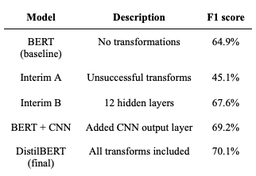

# W266 Natural Language Processing with Deep Learning
## Increasing Efficacy of Federal Firearm Background Checks by Identifying Patterns of Threatening Language
#### By: Aditya Bajaj, Gerrit Lensink, Ruby Han

## Abstract
This paper presents pre-trained BERT and CNN models with the purpose of identifying and detecting violent tendencies in written communication, with respect to labeled data across toxic, hate-speech, insults, explicit threats, and other abnormal comments. This is a complex task for multiple reasons. Firstly, due to the intrinsic nature and subjectivity of a ‘violent’ comment. In addition, a ‘violent’ comment may not necessarily originate from single words such as a swear word but rather from multi-word expressions. To address these challenges, we provide comparisons of various models across different pre-processing techniques and architectures, leading to an improvement in F1 score of 5 percent while using the DistilBERT model. The results obtained suggest that using BERT models is a promising approach and could be used to better understand and identify violent patterns in speech, which may be used to improve efficacy of background checks.

Please see [google drive folder](https://drive.google.com/drive/u/0/folders/1p1bDkEjmNKPzX456WZWBr8qtvPr6Pt5m) for datasets, codes, model checkpoints and etc. for items not found in current GitHub Repo.

## Models Built
The below is an abridged table of various model architectures and iterations we've built. Please see [spreadsheet](https://docs.google.com/spreadsheets/d/1o0DFDm--x-r_DFVt0vk8S3DCQdf_BgJy1THFMChbAyw/edit#gid=0) for detailed table summary.

|Model # |Architecture                                      |Transform Set|Hyperparameters                                                                                                                                                                                                                                                      |Precision|Recall |F1 Score|
|--------|--------------------------------------------------|-------------|---------------------------------------------------------------------------------------------------------------------------------------------------------------------------------------------------------------------------------------------------------------------|---------|-------|--------|
|Baseline|BERT  base-cased output type = pooled             |None         |max_seq = 128 tokenizer = bert-base-cased train/val split: 80/20 100K exs batch_size = 32 epochs = 5 dropout = 0.3 lr = 0.00005 optimizer = Adam hidden_size = 150                                                                                                   |51.90%   |86.70% |64.90%  |
|2       |BERT  base-cased output type = pooled             |1            |max_seq = 128 tokenizer = bert-base-cased train/val split: 80/20 10K exs batch_size = 8 epochs = 2                                                                                                                                                                   |50.30%   |71.60% |59.10%  |
|3       |BERT  base-cased output type = pooled             |1            |max_seq = 128 tokenizer = bert-base-cased train/val split: 80/20 10K exs batch_size = 32 epochs = 10                                                                                                                                                                 |53.00%   |84.20% |65.00%  |
|4       |BERT  base-cased output type = pooled             |1            |max_seq = 128 tokenizer = bert-base-cased train/val split: 80/20 10K exs batch_size = 8 epochs = 2  Sim. Undersampling @ 50%                                                                                                                                         |31.00%   |100.00%|47.30%  |
|5       |BERT  base-cased output type = pooled             |1            |max_seq = 128 tokenizer = bert-base-cased train/val split: 80/20 10K exs batch_size = 32 epochs = 5  Sim. Undersampling @ 50%                                                                                                                                        |46.02%   |95.70% |62.20%  |
|6.a     |BERT  base-uncased output type = pooled           |2            |additional transf on datasets max_seq = 128 tokenizer = bert-base-uncased train/val split: 80/20 10K exs batch_size = 32 epochs = 5  Sim. Undersampling @ 50%                                                                                                        |29.26%   |98.40% |45.10%  |
|7       |BERT  base-cased output type = pooled             |3            |additional transf on datasets max_seq = 128 tokenizer = bert-base-cased train/val split: 80/20 10K exs batch_size = 32 epochs = 5  Sim. Undersampling @ 62.5%  on violent set                                                                                        |33.39%   |94.80% |49.40%  |
|8       |BERT  base-cased output type = pooled             |3            |additional transf on datasets max_seq = 128 tokenizer = bert-base-cased train/val split: 80/20 10K exs batch_size = 32 epochs = 5  Sim. Undersampling @ 70%  on violent set                                                                                          |35.11%   |97.70% |51.70%  |
|9       |BERT  base-cased output type = pooled             |3            |additional transf on datasets max_seq = 128 tokenizer = bert-base-cased train/val split: 80/20 10K exs batch_size = 32 epochs = 5 dropout = .37  Sim. Undersampling @ 70%  on violent set                                                                            |32.26%   |97.69% |48.50%  |
|10      |BERT  base-cased output type = pooled             |3            |additional transf on datasets max_seq = 128 tokenizer = bert-base-cased train/val split: 80/20 10K exs batch_size = 32 epochs = 5 dropout = 0.1 lr = 0.00002 optimizer = AdamW  Sim. Undersampling @ 62.5%  on violent set                                           |38.74%   |95.00% |55.00%  |
|11      |BERT  base-cased output type = pooled             |3            |additional transf on datasets max_seq = 128 tokenizer = bert-base-cased train/val split: 80/20 10K exs batch_size = 32 epochs = 5 dropout = 0.1 lr = 0.00002 optimizer = AdamW hidden_size = 150  Sim. Undersampling @ 62.5%  on violent set                         |37.13%   |97.70% |53.80%  |
|12      |BERT  base-cased output type = pooled             |3            |additional transf on datasets max_seq = 128 tokenizer = bert-base-cased train/val split: 80/20 10K exs batch_size = 32 epochs = 2 dropout = 0.05 lr = 0.00002 optimizer = AdamW hidden_size = 150  Sim. Undersampling @ 62.5%  on violent set                        |35.33%   |97.70% |51.90%  |
|13      |BERT  base-cased output type = pooled             |3            |additional transf on datasets max_seq = 128 tokenizer = bert-base-cased train/val split: 80/20 10K exs batch_size = 16 epochs = 5 dropout = 0.1 lr = 0.00002 optimizer = AdamW hidden_size = 150  Sim. Undersampling @ 62.5%  on violent set                         |35.33%   |97.70% |51.90%  |
|14      |BERT  base-cased output type = pooled             |3            |additional transf on datasets max_seq = 128 tokenizer = bert-base-cased train/val split: 80/20 10K exs batch_size = 16 epochs = 2 dropout = 0.05 lr = 0.00001 optimizer = AdamW hidden_size = 100  Sim. Undersampling @ 62.5%  on violent set                        |34.87%   |97.70% |51.40%  |
|15      |BERT  base-cased output type = pooled             |3            |additional transf on datasets max_seq = 128 tokenizer = bert-base-cased train/val split: 80/20 10K exs batch_size = 32 epochs = 2 dropout = 0.1 lr = 0.00002 optimizer = AdamW hidden_size = 150  Sim. Undersampling @ 62.5%  on violent set                         |40.61%   |98.60% |57.50%  |
|16      |BERT  base-cased output type = pooled             |3            |additional transf on datasets max_seq = 128 tokenizer = bert-base-cased train/val split: 80/20 35K exs batch_size = 32 epochs = 2 dropout = 0.1 lr = 0.00002 optimizer = AdamW hidden_size = 150  No Undersampling                                                   |50.83%   |86.90% |64.10%  |
|17      |BERT  base-cased output type = pooled             |3            |additional transf on datasets max_seq = 128 tokenizer = bert-base-cased train/val split: 80/20 10K exs batch_size = 8 epochs = 10 dropout = 0.1 lr = 0.00002 optimizer = AdamW hidden_size = 100  Sim. Undersampling @ 62.5%  on violent set                         |42.00%   |93.60% |58.00%  |
|18      |BERT  base-cased output type = pooled             |3            |additional transf on datasets max_seq = 128 tokenizer = bert-base-cased train/val split: 80/20 10K exs batch_size = 32 epochs = 10 dropout = 0.1 lr = 0.00002 optimizer = AdamW hidden_size = 150  Sim. Undersampling @ 62.5%  on violent set                        |43.88%   |94.10% |59.80%  |
|19      |BERT  base-cased output type = pooled             |3            |additional transf on datasets max_seq = 128 tokenizer = bert-base-cased train/val split: 80/20 35K exs batch_size = 8 epochs = 2 dropout = 0.1 lr = 0.00002 optimizer = AdamW hidden_size = 150  No Undersampling                                                    |49.23%   |88.91% |63.40%  |
|20      |BERT  base-cased output type = pooled             |3            |additional transf on datasets max_seq = 128 tokenizer = bert-base-cased train/val split: 80/20 35K exs batch_size = 8 epochs = 2 dropout = 0.25 lr = 0.00002 optimizer = AdamW hidden_size = 150  No Undersampling                                                   |48.10%   |87.40% |62.00%  |
|21      |BERT  base-cased output type = pooled             |3            |max_seq = 128 tokenizer = bert-base-cased train/val split: 80/20 10K exs batch_size = 32 epochs = 10  **This is a model #3 redo - feeding correct transf dataset                                                                                                     |49.80%   |77.70% |60.70%  |
|22      |BERT  base-cased output type = pooled             |3            |additional transf on datasets max_seq = 128 tokenizer = bert-base-cased train/val split: 80/20 35K exs batch_size = 8 epochs = 2 dropout = 0.25 lr = 0.00002 optimizer = AdamW hidden_size = 150 hidden_layers = 2 No Undersampling                                  |46.20%   |89.90% |61.10%  |
|23      |BERT  base-cased output type = pooled             |4            |max_seq = 128 tokenizer = bert-base-cased train/val split: 80/20 10K exs batch_size = 32 epochs = 10  **This is a model #21 redo - feeding transf dataset w/o ip address removal                                                                                     |59.20%   |67.30% |63.00%  |
|24      |BERT  base-cased output type = pooled             |3            |max_seq = 128 tokenizer = bert-base-cased train/val split: 80/20 35K exs batch_size = 32 epochs = 10 dropout = 0.1 lr = 0.00002 optimizer = AdamW hidden_size = 150  No Undersampling  **this is a model 16 re-run with higher epochs (10 vs. 2)                     |63.90%   |77.20% |69.90%  |
|25      |BERT  base-cased output type = pooled             |3            |max_seq = 128 tokenizer = bert-base-cased train/val split: 80/20 100K exs batch_size = 32 epochs = 3 dropout = 0.1 lr = 0.00002 optimizer = AdamW hidden_size = 150  No Undersampling  **this is a model 24 re-run with more data, fewer epochs                      |46.50%   |92.90% |62.00%  |
|26      |BERT  base-cased output type = pooled             |3            |max_seq = 128 tokenizer = bert-base-cased train/val split: 80/20 100K exs batch_size = 32 epochs = 5 dropout = 0.1 lr = 0.00002 optimizer = AdamW hidden_size = 150  No Undersampling  **this is a model 24 re-run with more data, fewer epochs                      |54.40%   |88.40% |67.40%  |
|27      |BERT  base-cased output type = pooled             |3            |max_seq = 128 tokenizer = bert-base-cased train/val split: 80/20 100K exs batch_size = 32 epochs = 5 dropout = 0.2 lr = 0.00002 optimizer = AdamW hidden_size = 150 hidden_layers = 2 No Undersampling  **this is a model 24 re-run with more data, fewer epochs     |55.58%   |88.06% |68.10%  |
|28      |DISTILBERT output type = cls                      |3            |max_seq = 128 tokenizer = bert-base-cased train/val split: 80/20 10K exs batch_size = 32 epochs = 5 dropout = 0.2 lr = 0.00002 optimizer = AdamW hidden_size = 150 hidden_layers = 2 No Undersampling                                                                |60.00%   |81.12% |69.00%  |
|29      |BERT  base-cased output type = pooled             |3            |max_seq = 128 tokenizer = bert-base-cased train/val split: 80/20 100K exs batch_size = 32 epochs = 5 dropout = 0.2 lr = 0.00002 optimizer = AdamW hidden_size = 768 hidden_layers = 12  No Undersampling                                                             |55.61%   |86.12% |67.60%  |
|30      |distilbert output type = cls                      |3            |max_seq = 128 tokenizer = distilbert-base-uncased train/val split: 80/20 100K exs batch_size = 32 epochs = 100/7 dropout = 0.1 lr = 0.00001 optimizer = AdamW hidden_size = 50 hidden_layers = 2 No Undersampling                                                    |57.60%   |90.06% |70.30%  |
|31      |BERT base-cased output type = cls CNN output layer|3            |max_seq = 128 tokenizer = bert-base-cased train/val split: 80/20 10K exs batch_size = 32 epochs = 100 dropout = 0.1 lr = 0.00001 num_filters = [100, 100, 50, 25] kernel_sizes = [3, 5, 10, 20] optimizer = AdamW hidden_size = 50 hidden_layers = 2 No Undersampling|60.62%   |80.51% |69.20%  |
|32      |distilbert-base-uncased                           |4            |hidden_size=450, dropout=0.1, learning_rate=0.00002, weight_decay=0                                                                                                                                                                                                  |53.53%   |84.77% |65.62%  |
|33      |distilbert output type = cls                      |3            |max_seq = 128 tokenizer = distilbert-base-uncased train/val split: 80/20 Full data batch_size = 32 epochs = 100/6 dropout = 0.1 lr = 0.00001 optimizer = AdamW hidden_size = 50 hidden_layers = 2 No Undersampling                                                   |59.46%   |85.30% |70.10%  |
|34      |distilbert-base-uncased                           |5            |Replacing asterisks with 1 hashtag hidden_size=450, dropout=0.1, learning_rate=0.00002, weight_decay=0                                                                                                                                                               |57.59%   |77.49% |66.07%  |
|35      |distilbert-base-uncased                           |6            |Replacing asterisks with 1 hashtag and replacing text in double quotes with whitespacehidden_size=450, dropout=0.1, learning_rate=0.00002, weight_decay=0                                                                                                            |57.14%   |70.45% |63.10%  |

## Result Summary

**Performance Metric:**

## Conclusion
Our experimentation in transformations, tokenization, and hyperparameter tuning led to a roughly five point increase in F1 score from baseline for violent intent detection based on language model architecture. We attribute the majority of this improvement towards intentional transformations targeting increasing distance between vector representations of violent and non-violent comments, pre-training. 

Additionally, our research was concentrated on coercion of embeddings, and then fine-tuning a classification layer based on static BERT pre-trained vector representations. Work related to fine-tuning the embedding layer for our particular task is also expected to improve performance. 

Another way of improving precision for the model would be to add more toxic data to the current dataset. Due to the class imbalance, the model was predicting a high percentage of false positives. 

Finally, using the above dataset it is shown that machine learning models may be used as a means of filtering candidates applying for a gun license. Using techniques outlined in this paper may lead to a safer America, driven by more holistic background checks.
